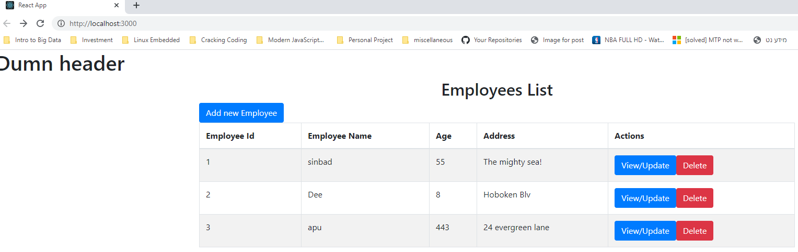

<h1>How to use backend services:</h1>
Prerequisites: have mysql installed on local computer
<h2> 1) Configure application</h2> 
Configure mysql login data and initialization data under src->main->resources->application.properties.
Enter personal spring.datasource.username and spring.datasource.password
Can initialize data to go into employees table using file "data.sql"; Initially, 3 dummy workers are entered into table, but can 
add own data using standard mysql syntax. 
Server Port (where Http requests are sent to) is initially set to 9090

<h2> 2) Start Server by running main in ReadcruddemoApplication</h2>

<h2> 3) Run commands</h2>
To run a command locally, open up service such as Postman.
Base URI before calling each method is "localhost:9090/".
The methods that can be called appear in EmployeeController file, with the format of how to enter the command
appearing in the annotation above the method.

For  example, to get a list of all employees, we use "GET localhost:9090/getAllEmployees":
 

  

To get details of specific employee by their id, enter "GET localhost:9090/getEmployeeById/{id}"

  

To add a new employee, enter "POST localhost:9090/addEmployee", and enter the employee details as json in message body:

  

To update existing employee, enter "PUT localhost:9090/updateEmployee/{id}"

  

To get all employees in given area, call "GET localhost:9090/getEmployeesInArea"
To get all employees within a given area, you must supply in request body a json object representing 
a circle to search through (i.e., body should be of format {center: {x: , y:}, radius: })

  

<h2> Notes </h2>
<ul>
<li>To provide arguments in request body using postman, select "Body" radio button, then "raw" and set type to "JSON"</li> 

<li>You can see tables in database and query data with regular mysql using mysql shell or workbench: </li> 

  

<li>A user is not able to create or update an employee id, so if it is provided as an argument in either the 
addEmployee or updateEmployee, an error response will be returned: </li>

  

</ul>

<h1>How to use front services (in progress):</h1>
prerequisites: have node.js installed 

<h2>1) install dependencies</h2>
Navigate to frontend/readcruddemo-front in terminal, and install node modules using npm install
<h2>2) run npm start</h2>
Make sure backend server is already running, then enter "npm start" from within frontend/readcruddemo-front directory.
<h2>3) begin adding new users</h2>
When React starts, it will open up a new browser at localhost:3000, which shows a list of all employees currently in db

  

To add a new employee, click on "Add new employee" button and enter details. At the moment, only a name and age are required.

  

<h2>TODO</h2>
<ul>
<li>initialize form data with employee details after clicking "view/update"</li>
<li>implement delete</li>
<li>change headers based on service</li>
</ul>